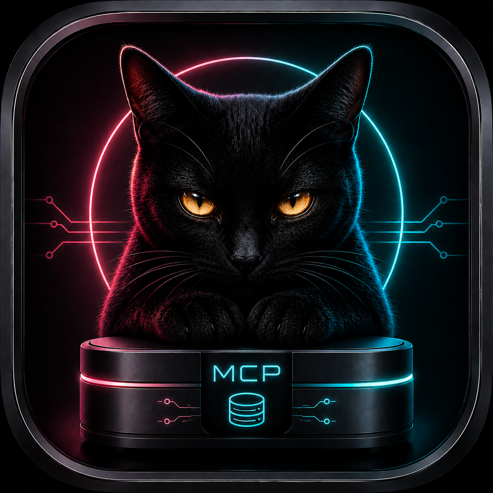

<p align="center">
  
</p>

<h1 align="center">NALA-MCP-cORe (Deutsch)</h1>

<p align="center">
  <strong>Natives macOS & Windows Kontrollzentrum für lokale MCP-Speicherkerne und SQLite-Datenbanken.</strong>
</p>

<p align="center">
  <a href="README.md">English</a> • 
  <a href="README.fr.md">Français</a> • 
  <a href="README.it.md">Italiano</a>
</p>

---

## 🚀 Einfacher Download & Installation (Für Endbenutzer)

Du musst diese App **NICHT** selbst kompilieren oder programmieren, um sie zu nutzen!

1. Gehe rechts auf dieser GitHub-Seite in den Bereich **[Releases](https://github.com/Master-MD/NALA-MCP-cORe/releases)**.
2. Lade das Paket für dein Betriebssystem herunter:
   - **macOS:** Lade die `.dmg`-Datei herunter (unterstützt Apple Silicon/ARM und Intel Macs).
   - **Windows:** Lade die `.zip`- oder `.exe`-Datei herunter (unterstützt Intel/AMD x64 und ARM64).
3. Öffne die heruntergeladene Datei, ziehe die App in deine Anwendungen (macOS) oder entpacke und starte die `.exe` (Windows) und wähle deinen lokalen Speicherort aus.

---

## 💡 Was die App tut & Die Idee dahinter

**NALA-MCP-cORe** ist ein lokaler, sicherer Datentresor, der als "Gehirn" oder Gedächtniskern für KI-Clients wie Codex, Gemini CLI, Google Antigravity und zukünftige NALA-Workflows dient. Er speichert Projektdaten, Entscheidungen, Fehlerberichte und Sessions sicher in einer lokalen SQLite-Datenbank.

### Hauptmerkmale:
- **Zero-Cloud & 100% Lokal:** Deine Daten verlassen niemals deinen Computer. Keine Accounts, keine APIs, keine Cloud-Keys erforderlich.
- **Plattformübergreifend:** Native macOS-App geschrieben in SwiftUI & native Windows-App geschrieben in C#/WPF.
- **Intelligente FTS5-Indexierung:** Ultra-schnelle Volltextsuche direkt in der Datenbank.
- **JSONL Event-Journal:** Ein fälschungssicheres Protokoll aller Ereignisse für absolute Transparenz.
- **Automatische Systemsprache:** Erkennt deine Systemsprache automatisch (Deutsch, Englisch, Französisch, Italienisch).
- **Schutz vor unberechtigten Zugriffen:** Blockiert unbekannte Clients oder destruktive Tools automatisch.

---

## 📸 Screenshots aus der App

### macOS App
*Schickes, natives macOS Kontrollzentrum im Dark Mode mit Anzeige von CPU, Arbeitsspeicher, aktiven Clients und Einrichtungs-Assistenten.*
<p align="center">
  
</p>

### Windows App
*Natives WPF-Dashboard unter Windows mit Statusanzeige, Pfad-Auswahl und Echtzeit-Protokollen.*
<p align="center">
  
</p>

---

## ❓ FAQ (Häufig gestellte Fragen)

### F: Wo werden meine Daten gespeichert?
Deine Daten liegen komplett lokal auf deiner Festplatte an einem Ort deiner Wahl (z.B. unter `~/Library/Application Support/NALA-MCP-cORe/` auf dem Mac oder `C:\Users\<Name>\AppData\Local\NALA-MCP-cORe\` unter Windows).

### F: Kann ich Cloud-synchronisierte Ordner nutzen?
Ja! Die Ordnerauswahl unterstützt Verzeichnisse, die über iCloud Drive, Google Drive Desktop, Dropbox oder Synology Drive synchronisiert werden.

### F: Warum wird meine Verbindung blockiert?
Standardmäßig nutzt der Kern eine strikte Sicherheitsrichtlinie. Unbekannte Programme oder destruktive Befehle werden automatisch abgelehnt, um deine Datenbank zu schützen.

---

## 🛠️ Monorepo-Ordnerstruktur

Dieses Repository ist als Monorepo aufgebaut:
- `/macOS`: Beinhaltet die native macOS SwiftUI App.
- `/Windows`: Beinhaltet die native Windows C# WPF App.
- `/.github/workflows`: Beinhaltet die automatisierten CI/CD Build-Pipelines.

---

## 🏗️ Entwickler-Sektion (Kompilieren)

### macOS (Swift)
```bash
cd macOS
swift test
./script/build_and_run.sh --stable
```

### Windows (.NET 8.0)
```cmd
cd Windows
dotnet build src/NALAMCPcOReWIN/NALAMCPcOReWIN.csproj -c Release
dotnet run --project src/NALAMCPcOReWIN/NALAMCPcOReWIN.csproj
```
